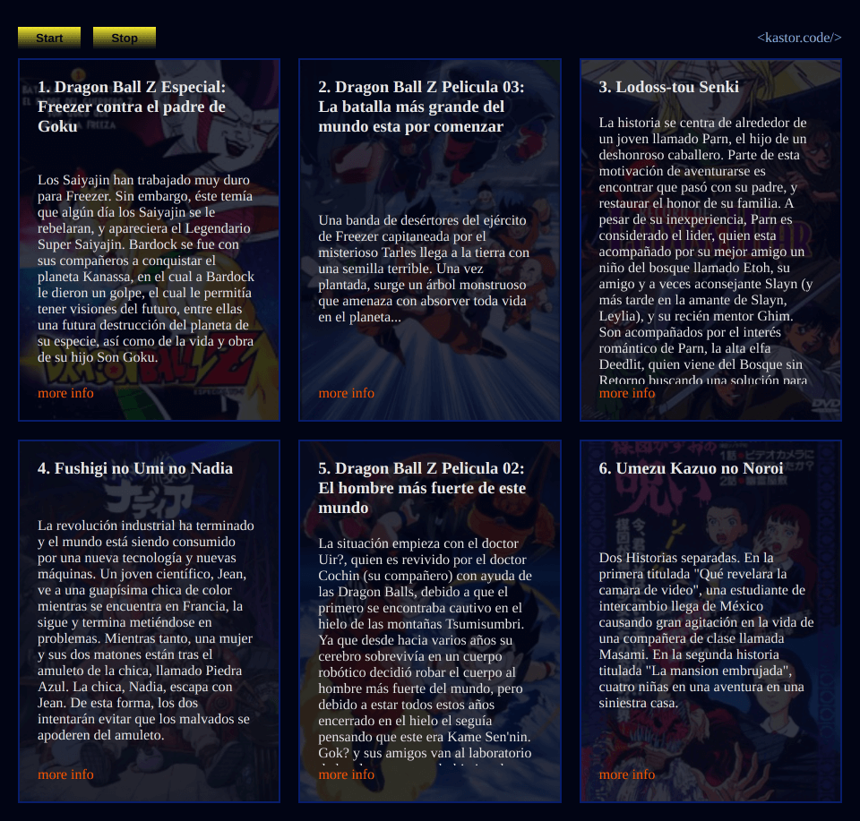

## Webstreams Fullstack: Node.js and Browser

> 👷 Developed by Matheus Ramalho de Oliveira  
🔨 Brazilian Software Engineer  
🏡 Goiânia, Goiás, Brasil  
✉️ kastorcode@gmail.com  
👍 [instagram.com/kastorcode](https://instagram.com/kastorcode)

---

  This script consumes unlimited gigabytes of files without crashing and with functionality to cancel requests. We will convert CSV to NDJSON and render the data in an HTML page, processing everything on demand using webstreams.

---

### Screenshot

  

---

### Installation and execution

Backend

1. Make a clone of this repository;
2. Open the server folder in a terminal;
3. Run `yarn` to install dependencies;
4. Run `yarn dev` to start the server;
5. Create a folder called `dataset`;
6. Download a data pack: `https://kaggle.com/datasets/danielalbarracinm/list-of-anime-from-1990-to-2022?resource=download`;
7. Extract the data into the `dataset` folder.

Frontend

1. Open the app folder in a terminal;
2. Run `yarn` to install dependencies;
3. Run `yarn start` to serve the app.

---

  <big><b>&lt;kastor.code/&gt;</b></big>

